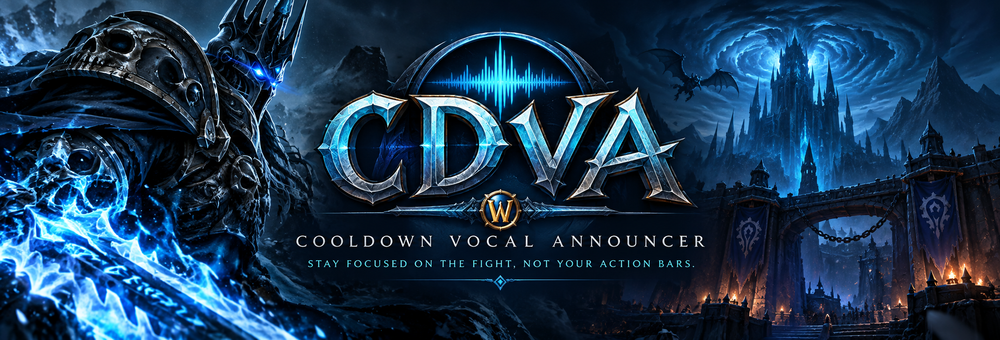
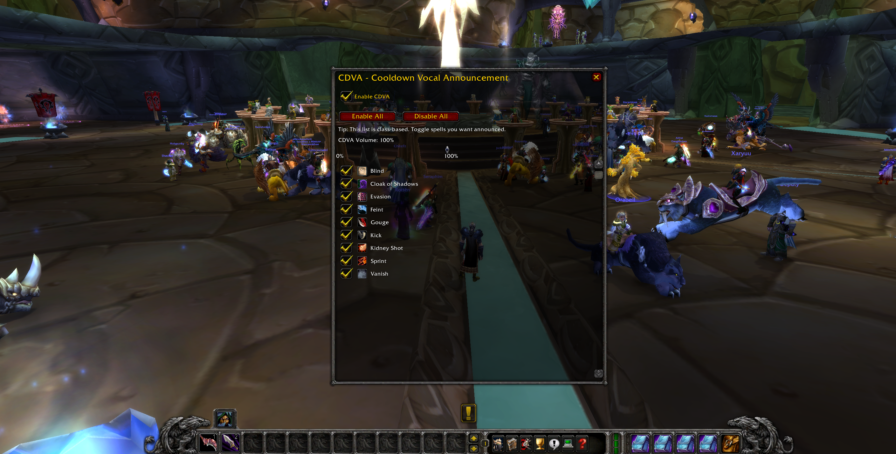

<p align="center">
  
</p>

# 🔊 CDVA — Cooldown Vocal Announcer

**Stay focused on the fight, not your action bars.**

CDVA is a lightweight World of Warcraft addon that provides real-time vocal announcements for spell cooldowns, helping players track important abilities without constantly watching UI elements.

Built in **Lua** and used by **5,000+ players**.

---

## 🎮 CDVA In Game

<p align="center">
  
</p>

*CDVA's in-game interface for configuring vocal cooldown announcements.*

---

## ⚔️ What It Does

During combat, CDVA provides audible notifications when important abilities become available.

Instead of repeatedly checking your action bars for cooldowns, CDVA lets you keep your attention where it belongs — on the fight.

### Features

- 🔊 Real-time vocal cooldown announcements
- ⚔️ Designed to reduce reliance on action bars during combat
- 🪶 Lightweight addon with minimal overhead
- 🎮 Support for multiple World of Warcraft versions
- 🔧 Simple configuration
- 🎧 Included vocal announcement sound files
- 🌎 Used by 5,000+ players

---

## 🎯 Why I Built It

Cooldown tracking is critical in World of Warcraft, but constantly checking action bars can take attention away from mechanics, positioning, and the actual fight.

CDVA was built around a simple idea:

> **If the game can tell you when an ability is ready, why should you have to keep looking for it?**

The addon turns cooldown information into vocal announcements, allowing players to react to abilities while keeping their eyes on combat.

---

## 🛠️ Built With


**Language:** Lua  
**Platform:** World of Warcraft  
**Type:** Combat / Accessibility / Cooldown Utility

---

## 📁 Project Structure

```text
CDVA/
│
├── Sounds/          # Vocal announcement audio
├── CDVA.toc         # World of Warcraft addon manifest
├── core.lua         # Core addon logic
├── UI.lua           # Configuration interface
└── README.md
```

---

## 📦 Installation

1. Download the latest version of CDVA.
2. Extract the `CDVA` folder.
3. Place it inside your World of Warcraft AddOns directory:

```text
World of Warcraft/
└── _version_/
    └── Interface/
        └── AddOns/
            └── CDVA/
```

4. Launch World of Warcraft.
5. Make sure **CDVA** is enabled under **AddOns** on the character selection screen.

> The exact World of Warcraft directory may differ depending on the game version being used.

---

## 🌐 Find CDVA

CDVA is distributed through the World of Warcraft addon community and can be found on:

- **CurseForge**
- **WoWInterface**
- **Discord**

---

## 📈 Project Reach

CDVA started as a tool for improving cooldown awareness during gameplay and grew into an addon used by **thousands of World of Warcraft players**.

**5,000+ players and counting.**

For me, the project has also been an opportunity to work with:

- Event-driven programming
- Lua
- Game APIs
- UI development
- Audio integration
- Version compatibility
- Maintaining software used by real users

---

## 🤝 Feedback & Contributions

Found a bug or have an idea?

Open an **Issue** in this repository with as much information as possible.

Contributions and suggestions are welcome.

---

## 👨‍💻 Author

Created and maintained by **r00t-Sicco**.

Built because staring at cooldown icons is considerably less fun than actually playing the game.
